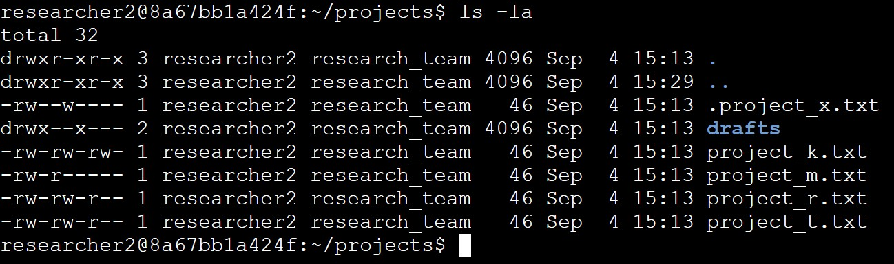
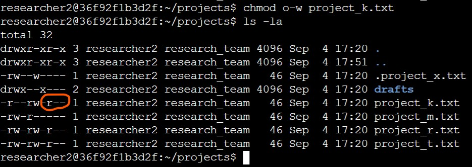
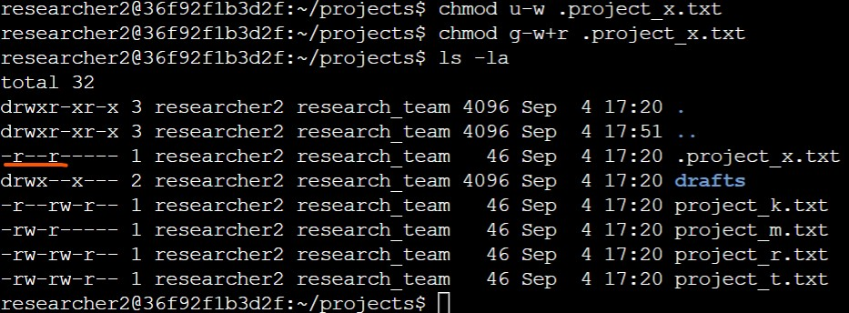
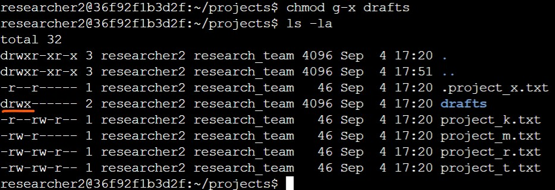

# Linux File Permissions

## Table of Contents
- [Overview](#overview)
- [Report](#report)
  - [Summary](#summary)
  - [Scenario](#scenario)
  - [Permission Status](#permission-status)
  - [Change File Permissions](#change-file-permissions)
  - [Change Hidden File Permissions](#change-hidden-file-permissions)
  - [Change Directory Permissions](#change-directory-permissions)
- [Reflections/Notes](#reflectionsnotes)
- [Author Information](#author-information)

## Overview
This report is part of a portfolio activity in the Google Cybersecurity Professional Certificate course. It describes a scenario of managing file permissions in Linux using command line. 

## Report

### Summary
An organization tasks a security researcher to manage file permission of their project documentation and ensure proper authorization. After checking the permissions of the projects folder, three issues are identified including write permissions for others, write permissions for hidden files, and access to the drafts folder. This report documents the status of authorization and permissions of the project folder and describes the actions taken to secure its content according to the organization's need.

### Scenario
You are a security professional at a large organization. You mainly work with their research team. Part of your job is to ensure users on this team are authorized with the appropriate permissions. This helps keep the system secure. 

Your task is to examine existing permissions on the file system. You’ll need to determine if the permissions match the authorization that should be given. If they do not match, you’ll need to modify the permissions to authorize the appropriate users and remove any unauthorized access. 

### Permission Status
The file and directory permissions, including hidden files, of a folder can be checked using the `ls` command with the option `-la`:
```bash
ls -la
```

This screenshot shows how to check the permissions of the `projects` folder:



The first line shows the entered Linux command, while the subsequent lines show the output. The output shows several files, a directory called `drafts`, and one hidden file `.project_x.txt` in the `projects` folder. The files and folders are owned by one user, `researcher2`, and by one group, `research_team`.

The permission strings in the output represent the current permissions of the files and folders in the directory. `d` stands for directory, `r` stands for _read_ permissions, `w` stands for _write_ permissions, and `-` stands for no permissions to the associated file or folder. The first triple after the directory flag (`d`, or `-`) describes the permissions for the user, in this case `researcher2`. The second triple decribes the permissions for the group, in this case `research_team`. And the third triple describes the permissions for any other groups. So for example, for the file `project_m.txt`: the permission string indicates it's a file (`-`), the user has _read_ and _write_ permissions (`rw-`), the group only _read_ permissions (`r--`), and other groups have no permissions (`---`).

This means for the content of the `projects` directory:

**Current Permissions**

| Name          | Type        | User (`researcher2`) | Group (`research_team`)| Other Groups  |
|---------------|-------------|----------------------|-----------------------|---------------|
| drafts/       | Directory   | read / write/ exec.  | exec.                 | none          |
| .project_x.txt| Hidden      | read / write         | write                 | none          |
| project_k.txt | File        | read / write         | read / write          | read / write  |
| project_m.txt | File        | read / write         | read                  | ---           |
| project_r.txt | File        | read / write         | read / write          | read          |
| project_t.txt | File        | read / write         | read / write          | read          |


### Change File Permissions
The organization does not allow others to have write access to any files. Consequently, the file permissions for the file `project_k.txt` need be changed accordingly. Using the `chmod` command with the option `-w`, the write permissions are removed. The full command is shown below:



### Change Hidden File Permissions
The research team of the organization has archived `project_x.txt`, which is why it is a hidden file. This file should not have any write permissions for anyone. But the user and the group should have read permissions. The actions (commands) to rectify the permissions are shown in the screenshot below:



### Change Directory Permissions
The files and directories in the projects directory belong to the `researcher2` user. Only `researcher2` should be allowed to access the `drafts` directory and its contents. The `drafts` directory currently allows the group to executue files. The actions (commands) to rectify the permissions are shown in the screenshot below:




## Reflections/Notes
*A security professional may have to manage authorizations and permissions in an organization. Therefore, knowledge about how such permissions can be changed via the Linux command line are essential.*


## Author Information
**Nadina (Oates) Zweifel**  
Blockchain Engineer | Security Researcher | Web3 | Cybersecurity | PhD  
🌐 [trashpirate.io](https://trashpirate.io)  
✖️ [x.com/0xTrashPirate](https://x.com/0xTrashPirate)  
💻 [github.com/trashpirate](https://github.com/trashpirate)  
🔗 [linkedin.com/in/nadinaoates](https://linkedin.com/in/nadinaoates)


*This document is maintained in a public GitHub repository for collaboration and reference. Contributions or feedback are welcome via pull requests or issues.*

_Date: September 4, 2025_