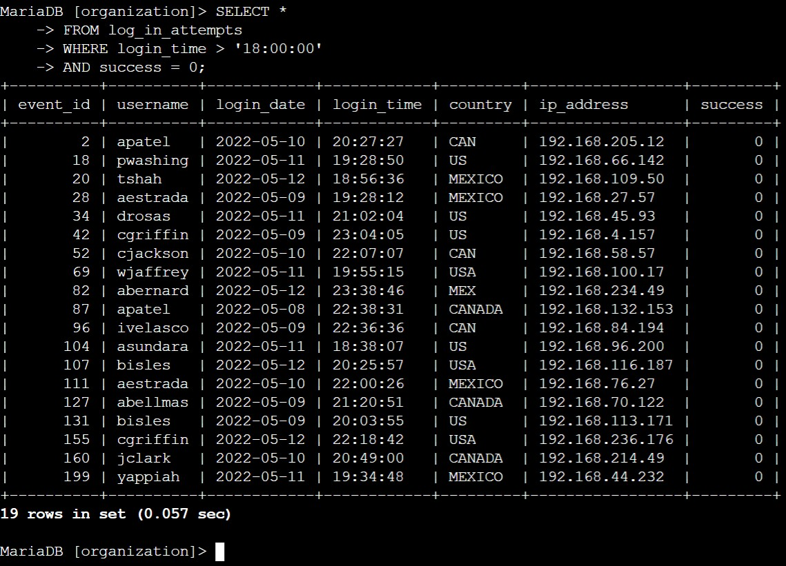
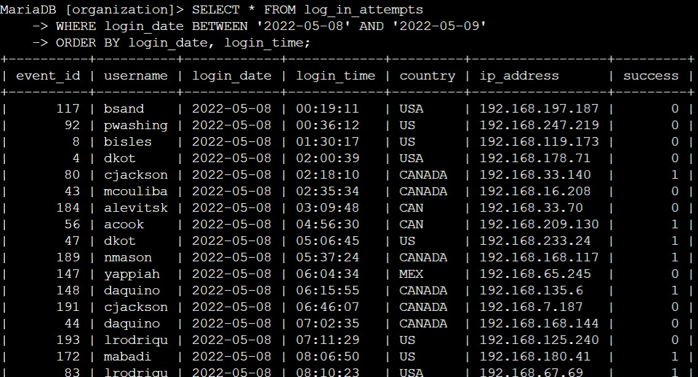
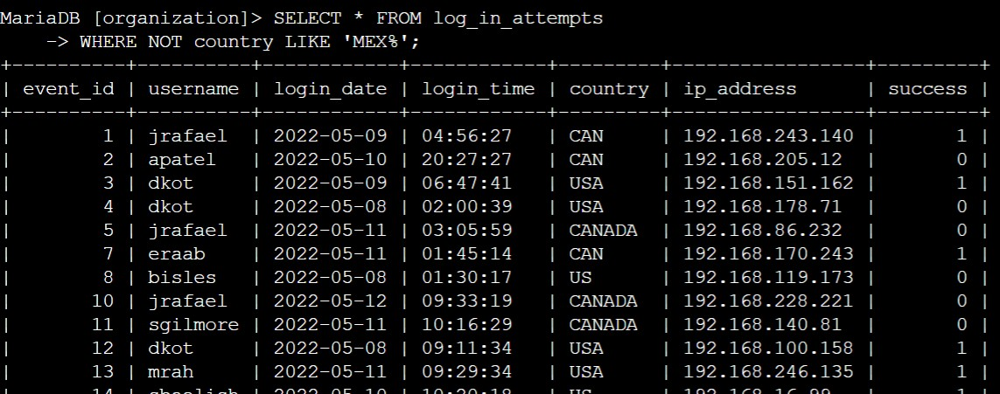
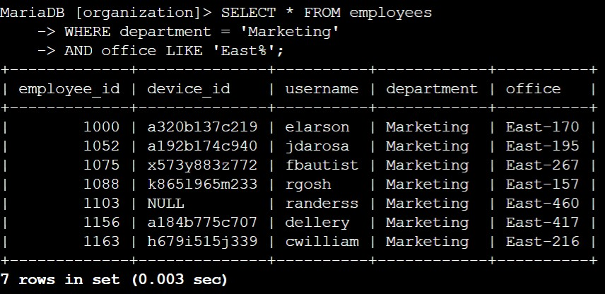
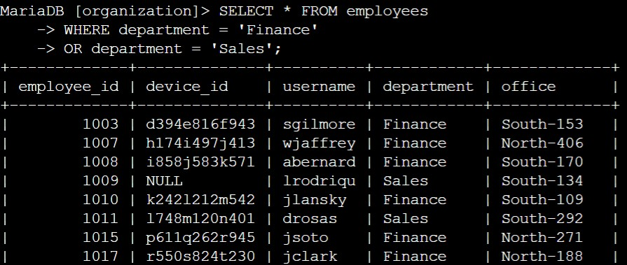
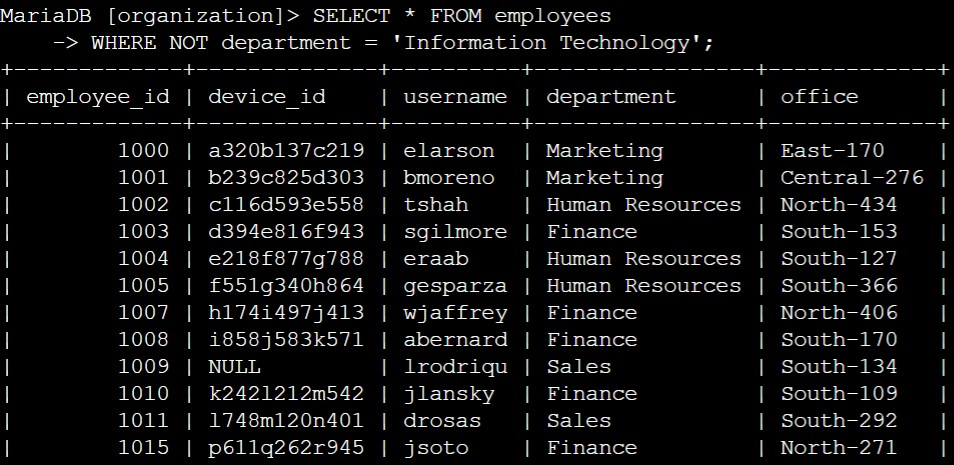

# SQL Investigation

## Table of Contents
- [Overview](#overview)
- [Report](#report)
  - [Summary](#summary)
  - [Scenario](#scenario)
  - [Time-based Filtering](#time-based-filtering)
  - [Date-based Filtering](#date-based-filtering)
  - [Location-based Filtering](#location-based-filtering)
  - [Department-based Filtering](#department-based-filtering)
- [Reflections/Notes](#reflectionsnotes)
- [Author Information](#author-information)

## Overview
This report is part of a portfolio activity in the Google Cybersecurity Professional Certificate course. It describes a scenario of using SQL queries to retrieve data from a database in order to investigate security incidents. 

## Report

### Summary
An organization has multiple potential security incidents that need to be investigated. Using SQL queries login attempts at certain dates and times as well as from specific locations are filtered to gain a better understanding of the login activity. Furthermore, the security team needs to update certain machines in the organization that belong to a specific group of employees. By filtering for department affiliation and office buildings the machines requiring the update can be quickly retrieved.

### Scenario
You are a security professional at a large organization. Part of your job is to investigate security issues to help keep the system secure. You recently discovered a potential security incident that occurred after business hours. 

Your task is to examine the organization’s data in their employees and log_in_attempts tables. You’ll need to use SQL filters to retrieve records from different datasets and investigate the potential security issues.

The organization database contains the following two tables:
● `log_in_attempts`
● `employees`

The `log_in_attempts` table has the following columns:
● `event_id`: The identification number assigned to each login event
● `username`: The username of the employee
● `login_date`: The date the login attempt was recorded
● `login_time`: The time the login attempt was recorded
● `country`: The country where the login attempt occurred
● `ip_address`: The IP address of that employee’s machine
● `success`: The success of the login attempt; FALSE indicates a failed attempt

The `employees` table has the following columns:
● `employee_id`: The identification number assigned to each employee
● `device_id`: The identification number assigned to each device used by the employee
● `username`: The username of the employee
● `department`: The department the employee is in
● `office`: The office the employee is located in

### Time-based filtering
Since the incident happened after hours, we can retrieve all failed login attempts that occured after 6pm (18:00:00). This can be done with the following SQL commands where we filter the `login_time` column for times after '18:00:00' and the `success` column for `0` values since they indicate failed attempts:

```SQL
SELECT * FROM log_in_attempts
WHERE login_time > '18:00:00'
AND success = 0;
```

The output of the command looks like this:



### Date-based filtering
A suspicious event occured on May 9, 2022 (2022-05-09). Thus, all login attempts that accured on this day and the day before should be reviewed. We can retrieve this data with an SQL command that filters for the specific dates, 2022-05-08 and 2022-05-09, using the BETWEEN operator. We order it by date and time to sort the output in chronological order.

```SQL
SELECT * FROM log_in_attempts
WHERE login_date BETWEEN '2022-05-08' AND '2022-05-09'
ORDER BY login_date, login_time;
```
This is a screenshot of the query output:



### Location-based filtering
There’s been suspicious activity with login attempts, but the team has determined that this activity didn't originate in Mexico. Therefore, we can filter the login attempts by location and exclude those that originated from Mexico. We use another SQL query that filters by `country` and exclude entries associated with Mexica using the `NOT` operator. Using the `LIKE` operator we can account for different labeling.

```SQL
SELECT * FROM log_in_attempts
WHERE NOT country LIKE 'MEX%';
```

A screenshot of the query is shown below:



### Department-based filtering
The team wants to perform security updates on specific employee machines in the Marketing department. To do these, we need to retrieve the data from all the employees from the Marketing department located in the East building. We run a query that filters the `department` column of the `employees` table for `Marketing`. We combine the query with a filter on the `office` column to retrieve employes in offices with labels such as `East-170` or `East-320`. To do this we use the `LIKE` operater and a wildcard to allow all labels starting with the string `East`. 

```SQL
SELECT * FROM employees
WHERE department = 'Marketing'
```

A screenshot of the query is shown below:



The team now needs to perform a different security update on machines for employees in the Sales and Finance departments. To filter the associated employees we use the following SQL query:

```SQL
SELECT * FROM employees
WHERE department = 'Finance'
OR department = 'Sales';
```
A screenshot of the query is shown below:



Your team needs to make one more update to employee machines. The employees who are in the Information Technology department already had this update, but employees in all other departments need it. So we can filter for only machines from employees that are NOT in the IT department:

```SQL
SELECT * FROM employees
WHERE NOT department = 'Information Technology';
```

A screenshot of the query is shown below:




## Reflections/Notes
**


## Author Information
**Nadina (Oates) Zweifel**  
Blockchain Engineer | Security Researcher | Web3 | Cybersecurity | PhD  
🌐 [trashpirate.io](https://trashpirate.io)  
✖️ [x.com/0xTrashPirate](https://x.com/0xTrashPirate)  
💻 [github.com/trashpirate](https://github.com/trashpirate)  
🔗 [linkedin.com/in/nadinaoates](https://linkedin.com/in/nadinaoates)


*This document is maintained in a public GitHub repository for collaboration and reference. Contributions or feedback are welcome via pull requests or issues.*

_Date: September 4, 2025_