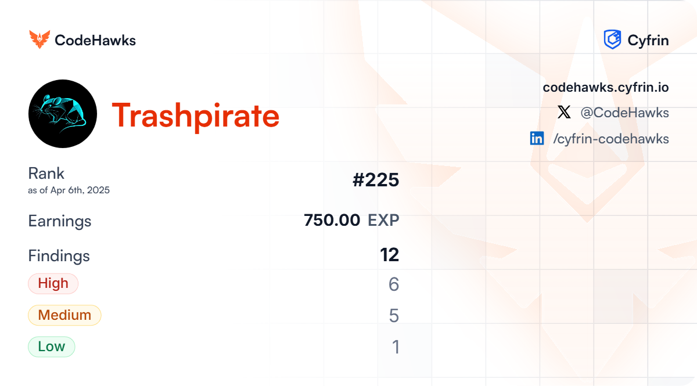

# Smart Contract Audits

## Overview
This folder contains a collection of smart contract audit reports focused on identifying vulnerabilities, assessing code quality, and recommending security improvements for blockchain-based applications. Each report reflects my expertise in analyzing smart contracts, with an emphasis on security best practices and risk mitigation in Web3 environments.

## Contents
- **[PasswordStore Audit Report](./24-09-30-password-store-audit.pdf)**
- **[PuppyRaffle Audit Report](./24-11-11-puppy-raffle-audit.pdf)**
- **[GivingThanks Audit Report](./24-11-12-giving-thanks-audit.pdf)**
- **[TSwap Audit Report](./24-11-18-t-swap-audit.pdf)**

## Rankings

### CodeHawks - First Flights

## Author

**Nadina (Oates) Zweifel**
Blockchain Engineer | Security Researcher | Web3 | Cybersecurity | PhD  
🌐 [trashpirate.io](https://trashpirate.io)  
✖️ [x.com/0xTrashPirate](https://x.com/0xTrashPirate)  
💻 [github.com/trashpirate](https://github.com/trashpirate)  
🔗 [linkedin.com/in/nadinaoates](https://linkedin.com/in/nadinaoates)

## License

Copyright © 2025 [Nadina Zweifel](https://github.com/trashpirate).
This project is [MIT](../LICENSE) licensed.

*This folder is part of my broader cybersecurity portfolio. Visit the [main repository README](../README.md) for more details on my projects and focus areas.*

_Last updated: September 2, 2025_